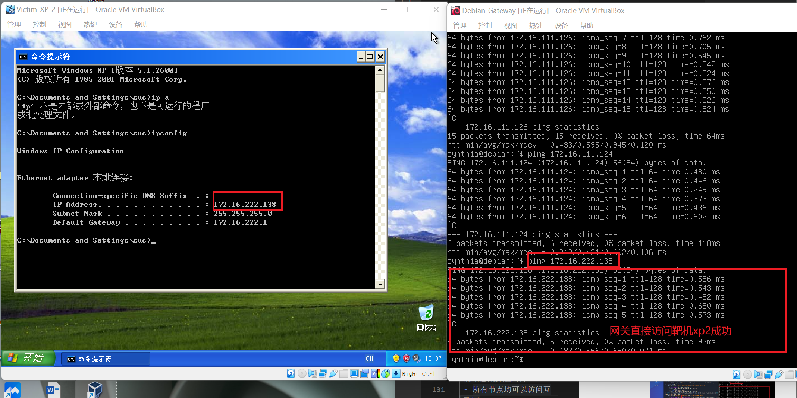
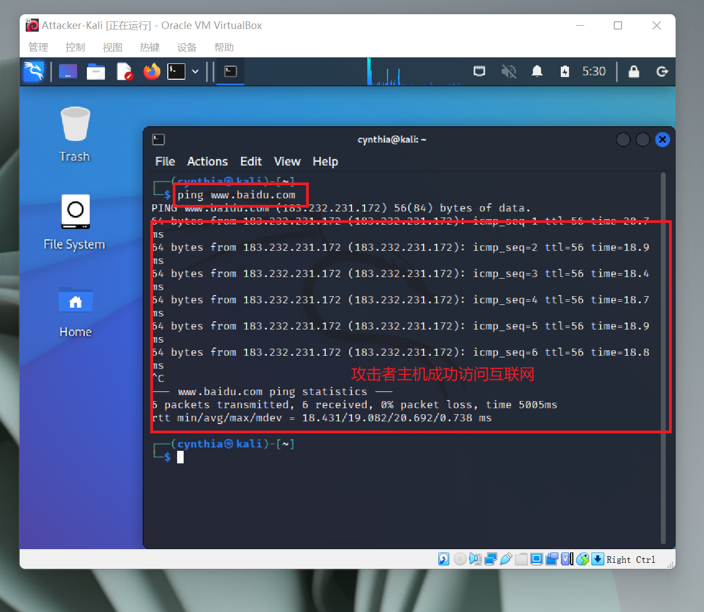

# 基于 VirtualBox 的网络攻防基础环境搭建

## 实验目的

* 掌握 VirtualBox 虚拟机的安装与使用；
* 掌握 VirtualBox 的虚拟网络类型和按需配置；
* 掌握 VirtualBox 的虚拟硬盘多重加载。

## 实验环境

* VirtualBox 虚拟机
* 攻击者主机（Attacker）：Kali Rolling 2022.3
* 网关（Gateway, GW）：Debian 10
* 靶机（Victim）：
  * kali 2022.3
  * Debian 10
  * Windows XP Professional with Service Pack 3 (x86)


## 实验要求

* 虚拟硬盘配置成多重加载，效果如下图所示；

 

* 搭建满足如下拓扑图所示的虚拟机网络拓扑；

  


* 完成以下网络连通性测试；
    - [x] 靶机可以直接访问攻击者主机
    - [x] 攻击者主机无法直接访问靶机
    - [x] 网关可以直接访问攻击者主机和靶机
    - [x] 靶机的所有对外上下行流量必须经过网关
    - [x] 所有节点均可以访问互联网

## 实验过程

### 一、安装虚拟机

  - 在自己的 `Virtualbox` 虚拟机里下载并安装 [最新版 `Kali` 的虚拟机镜像版](https://www.kali.org/get-kali/#kali-virtual-machines)；
  - 在自己的 `Virtualbox` 虚拟机里下载并导入 `Debian 10` 和 `Windows XP SP3` 的虚拟硬盘文件。 

### 二、虚拟硬盘配置成多重加载

 将 `Debian10.vdi` ,  `kali-linux-2022.3-virtualbox-amd64.vdi` ,  `xp_sp3_base.vdi` 设置成多重加载。

 步骤：管理->虚拟介质管理->选择对应的虚拟硬盘进行释放->属性选择多重加载并应用（如下图）。
  

### 三、搭建虚拟机网络拓扑

 - 根据实验要求的网络拓扑图，网关 `Debian-Gateway` 虚拟机需要配置四块网卡（详细配置见下图）。 <br>
  
    - 网卡1 `NAT 网络`：使网关可以访问 Attacker 主机；
    - 网卡2 `Host-Only 网络`：保证可以访问互联网；<br>
    
    - 网卡3 `内部网络 intnet1`：搭建局域网1；<br>
    
    - 网卡4 `内部网络 intnet2`：搭建局域网2；<br>
    

 - 攻击者 `Attacker-Kali` 虚拟机需保证与网关处在同一网络中，因此仅配置一块 `NAT 网卡` 使之能访问互联网即可。<br>
 

 - 根据网络拓扑图，受害者主机都需一块网卡，设置成内部网络，并使受害者主机处于对应的局域网内。
    - 局域网1（intnet1）：虚拟机 `Victim-XP-1` 和 `Victim-Kali-1`；<br>
     <br>
    

    - 局域网2（intnet2）：虚拟机 `Victim-Debian-2` 和 `Victim-XP-2`。<br>
    <br>
    

### 四、网络连通性测试

| 节点               | ip地址         | MAC地址           |
| ------------------ | -------------- | ----------------- |
| Attacker-Kali      | 10.0.2.15      | 08:00:27:e1:b3:74 |
| Victim-Kali-1       | 172.16.111.124 | 08:00:27:22:46:4f |
| Victim-XP-1 | 172.16.111.126  | 08:00:27:2A:F3:6D |
| Victim-Debian-2   | 172.16.222.136 | 08:00:27:fe:21:b4 |
| Victim-XP-2 | 172.16.222.138  | 08:00:27:21:66:64 |

<br>

本次实验具体的网络拓扑图如下（图中IP地址为实验时各虚拟机的IP地址）。<br>


 - 靶机可以直接访问攻击者主机
    - 局域网1：
        - `Victim-XP-1`：<br>
        <br>

        - `Victim-Kali-1`：<br>
        

    - 局域网2：
        - `Victim-XP-2`：<br>
        <br>

        - `Victim-Debian-2`：<br>
        


 - 攻击者主机无法直接访问靶机
    - 局域网1：
        - `Victim-XP-1`：<br>
        <br>

        - `Victim-Kali-1`：<br>
        

    - 局域网2：
        - `Victim-XP-2`：<br>
        <br>

        - `Victim-Debian-2`：<br>
        


 - 网关可以直接访问攻击者主机和靶机
    - 攻击者主机：<br>
    
    - 靶机：
        - `Victim-XP-1`：<br>
         
        - `Victim-Kali-1`：<br>
         
        - `Victim-XP-2`：<br>
         
        - `Victim-Debian-2`：<br>
         


 - 靶机的所有对外上下行流量必须经过网关

   > 靶机与互联网互通的过程中会通过网关获取目的地址的mac地址，再根据指定的IP地址进行转发包。在这个过程中用网关抓包，若网关能抓到靶机发送的所有包，则说明靶机的所有对外上下行流量必经过网关。

   ```bash
    # 清空靶机ARP缓存及DNS缓存
    # 靶机与互联网互通
    # 网关抓包：
      $ sudo tcpdump -c 5
   ```

    - 局域网1：
        - `Victim-XP-1`：<br>
        <br>

        - `Victim-Kali-1`：<br>
        

    - 局域网2：
        - `Victim-XP-2`：<br>
        <br>

        - `Victim-Debian-2`：<br>
        

    - 利用 tmux 将抓包数据文件复制到主机用 `WireShark` 分析
    ```bash
    # 在网关虚拟机 Debian 上安装tcpdump
    $ sudo apt update
    $ sudo apt install tcpdump

    # 后台执行抓包
    $ mkdir workspace
    $ cd workspace
    $ sudo tcpdump -i enp0s9 -n -w 20220919.kali.pcap

    # 在宿主机桌面打开终端，通过 scp 传送到本地，并在 WireShark 中分析数据包
    $ scp cynthia@192.168.56.102:/home/cynthia/workspace/20220919.kali.pcap 20220919.kali.pcap
    ```

    


    <br>

    > 经过分析发现，对应的IP数据均符合靶机和目标地址等信息，证明靶机的所有上下行流量必须经过网关。


 - 所有节点均可以访问互联网
     - 网关 `Debian-Gateway` ：<br>
    
     - 攻击者主机 `Attacker-Kali` ：<br>
    
    - 靶机：
        - `Victim-XP-1`：<br>
         
        - `Victim-Kali-1`：<br>
         
        - `Victim-XP-2`：<br>
         
        - `Victim-Debian-2`：<br>
         

## 遇到的问题及解决办法

 * 在启动 Windows xp-sp3 虚拟机时，无法连接本地网络。
    > Windows XP 系统太旧了，如果选择的网卡太高级会无法与该系统兼容。所以，在设置 Windows XP 虚拟机的网卡时将控制芯片从默认的 inter 1000 桌面换成 PCnet-FAST III。修改成功后，就可以正常连接到本地网络了。

 

 * NAT网络 发现无效设置，界面名称未指定。
    > 上网查找到了方法：管理 -> 全局设定 -> 网络 -> 添加NatNetwork

 

 * 无法访问 `Windows XP` 靶机：网关在访问攻击者主机、`Debian` 系统靶机和 `kali` 系统靶机都可以正常响应，只有访问 `Windows XP` 系统靶机时无响应。同时，`Windows XP` 系统靶机是可以正常访问互联网的。
    > 因为，`Windows XP`系统靶机可以正常上网，就说明是`Windows XP`系统靶机拒绝了 `ping` 命令，而不是因为`Windows XP`系统靶机断网而导致其无法访问。拒绝配合 `ping` 可能是因为系统安全策略中拒绝回显,所以只要**修改防火墙的规则**即可。

 

 * 网关、靶机和攻击者主机都无法访问互联网。
    > 因为我实验的时候开着VPN，导致端口被占用，无法正常访问互联网，把VPN关掉之后就可以正常访问了。就是因为这个小小的细节，导致我苦恼了很久。


## 参考资料

 * [Virtualbox网络连接方式选择NAT网络，无法指定界面名称的解决方法](https://blog.csdn.net/hexf9632/article/details/110197530)

 * [2022-ns-public-echo-li-cuc](https://github.com/CUCCS/2022-ns-public-echo-li-cuc/blob/524c4ee26b2180324be766636d73c5678866d3ba/chap0x01/chap0x01%E5%AE%9E%E9%AA%8C%E6%8A%A5%E5%91%8A.md)

 * [2022-ns-public-worrycuc](https://github.com/CUCCS/2022-ns-public-worrycuc/blob/chapter0x01/ch1/chapter01.md)