# 基于 Scapy 编写端口扫描器

## 实验目的

* 掌握网络扫描之端口状态探测的基本原理

## 实验环境

* python + scapy

## 实验要求

* 禁止探测互联网上的 IP ，严格遵守网络安全相关法律法规
* 完成以下扫描技术的编程实现
    * [x] TCP connect scan / TCP stealth scan
    * [x] TCP Xmas scan / TCP fin scan / TCP null scan
    * [x] UDP scan
* [x] 上述每种扫描技术的实现测试均需要测试端口状态为：`开放`、`关闭` 和 `过滤` 状态时的程序执行结果
* [x] 提供每一次扫描测试的抓包结果并分析与课本中的扫描方法原理是否相符？如果不同，试分析原因；
* [x] 在实验报告中详细说明实验网络环境拓扑、被测试 IP 的端口状态是如何模拟的
* [x] （可选）复刻 nmap 的上述扫描技术实现的命令行参数开关

## 实验网络拓扑
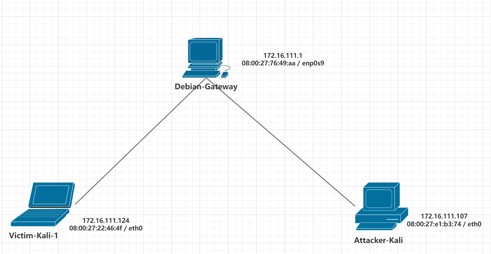

| 节点               | ip地址         | MAC地址 / 网卡           |
| ------------------ | -------------- | ----------------- |
| Debian-Gateway | `172.16.111.1`  | `08:00:27:76:49:aa / enp0s9` |
| Attacker-Kali | `172.16.111.107` | `08:00:27:e1:b3:74 / eth0` |
| Victim-Kali-1 | `172.16.111.124` | `08:00:27:22:46:4f / eth0` |

## IP 的端口状态模拟

* UDP 端口：
    * ```shell
        # 在 Victim 靶机开启 8080 端口
        $ nc -l -u -p 8080 
        # 局域网内其他主机可通过该操作向端口发送数据报，但是不会收到回复
        $ nc 172.16.111.124 -u 8080

        # 在 Victim 靶机关闭 8080 端口
        $ nc -l -u -p 8080 < /etc/passwd
        # 局域网内其他主机可通过该操作向端口发送数据报，会收到一个响应报
        $ nc 172.16.111.124 -u 8080
      ```

* 查看当前防火墙的状态和现有规则

   * ```shell
        $ ufw status
     ```

* 开放状态：Victim 靶机开启 apache2 服务，端口号为 80。

    * ```shell
        $ sudo systemctl start apache2
        $ sudo systemctl status apache2
      ```

* 关闭状态：Victim 靶机关闭 apache2 服务，Attacker 扫描 80 端口。

    * ```shell
        $ sudo systemctl stop apache2
        $ sudo systemctl status apache2
      ```

* 过滤状态：对应端口开启监听, 防火墙开启。

    * ```shell
        $ sudo apt-get update
        $ sudo apt install ufw
        $ sudo ufw enable
        $ sudo ufw status
        $ ufw deny 80
        $ sudo ufw default deny
      ```


## 实验过程

### TCP connect scan

* 课本原理：
    * Attacker 首先发送一个 SYN 数据包到目标主机端口
    * 如果接收到数据包，对数据包进行分析
        * 接收到 SYN/ACK 数据包：判断端口为开放状态，发送 ACK/RST 数据包
        * 接收到 RST/ACK 数据包：判断端口为关闭状态
    * 如果没有响应：被过滤

* 代码思路：
    > Attacker 先发送一个S，然后等待 Victim 靶机回应。如果有回应且标识为RA，说明目标端口处于关闭状态；如果有回应且标识为SA，说明目标端口处于开放状态。这时TCP connect scan会回复一个RA，在完成三次握手的同时断开连接.


    ```shell
    from scapy.all import *


    def tcpconnect(dst_ip, dst_port, timeout=10):
        pkts = sr1(IP(dst=dst_ip)/TCP(dport=dst_port,flags="S"),timeout=timeout)
        if pkts is None:
            print("Filtered")
        elif(pkts.haslayer(TCP)):
            if(pkts.getlayer(TCP).flags == 0x12):  #Flags: 0x012 (SYN, ACK)
                send_rst = sr(IP(dst=dst_ip)/TCP(dport=dst_port,flags="AR"),timeout=timeout)
                print("Open")
            elif (pkts.getlayer(TCP).flags == 0x14):   #Flags: 0x014 (RST, ACK)
                print("Closed")

    tcpconnect('172.16.111.124', 80)
    ```

* **TCP 端口开放：** 可以看到 Attacker 发送 SYN 的 TCP 数据包后， 80 端口进行握手回复了 SYN/ACK 数据报；Attacker 回复 RST 数据报，80 端口回复 RST/ACK 数据报。

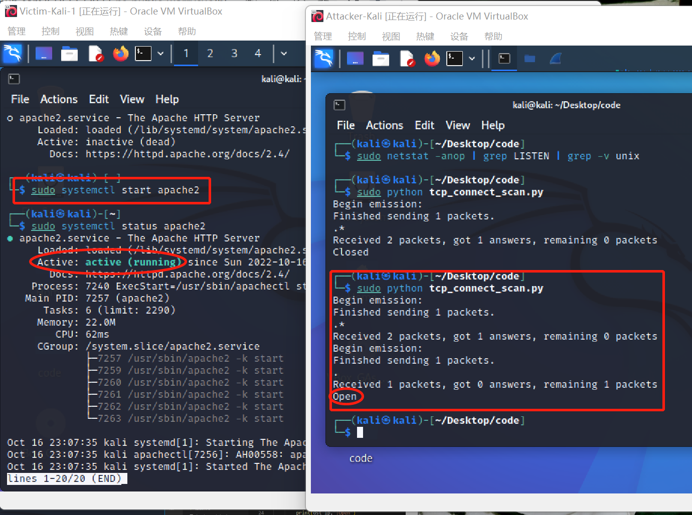
<br>

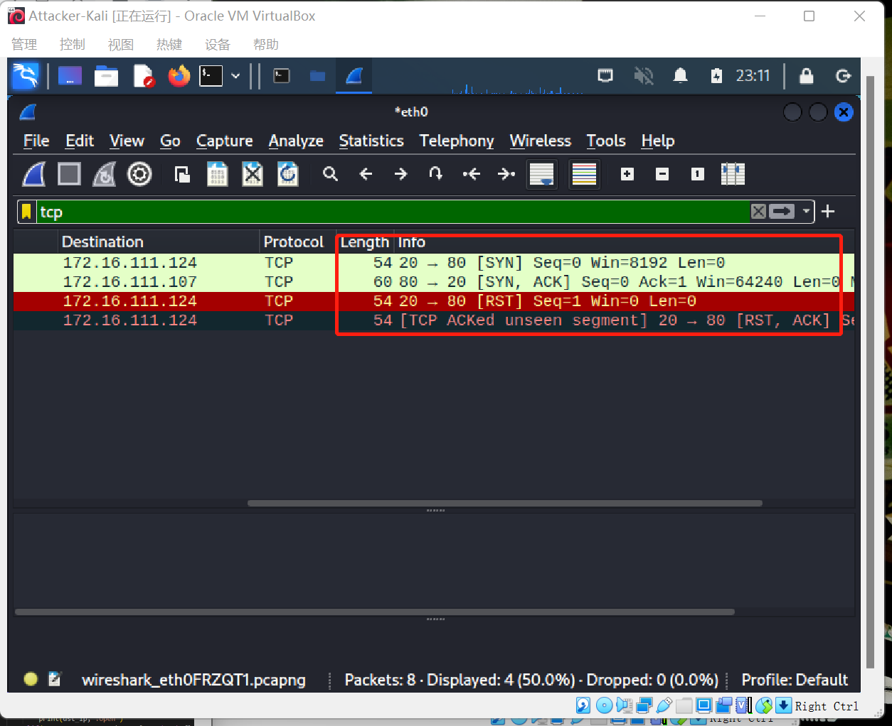
    

* **TCP 端口关闭：** 可以看到 Attacker 发送 SYN 的 TCP 数据包后， 80 端口关闭回复了 RST/ACK 数据报。

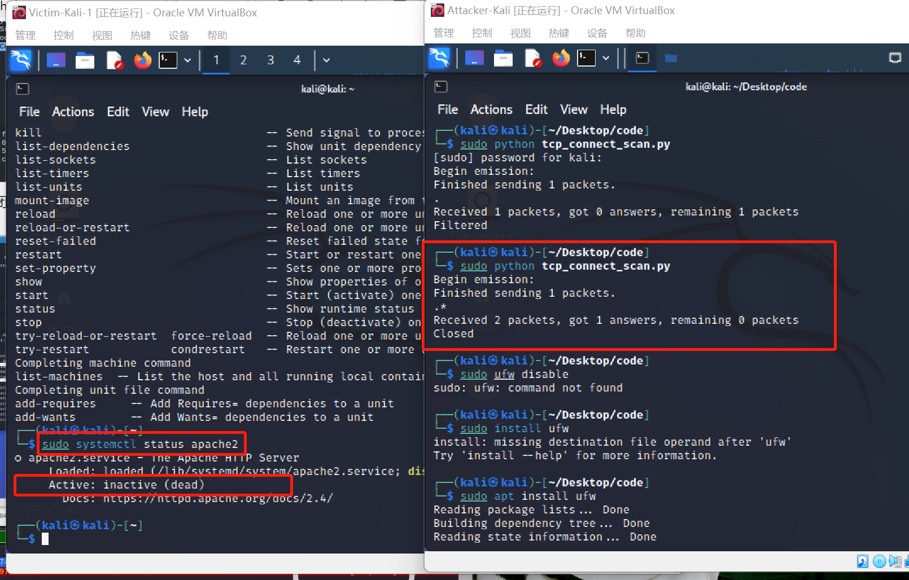
<br>

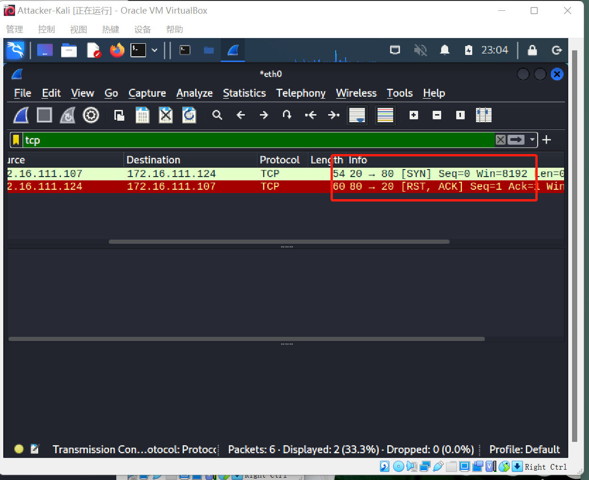

* **开启防火墙：**  Attacker 发送 SYN 的 TCP 数据包后， 80 端口无回应。

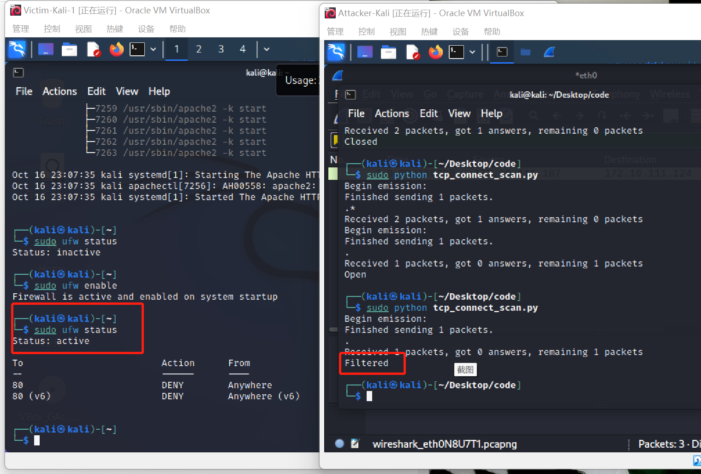
<br>

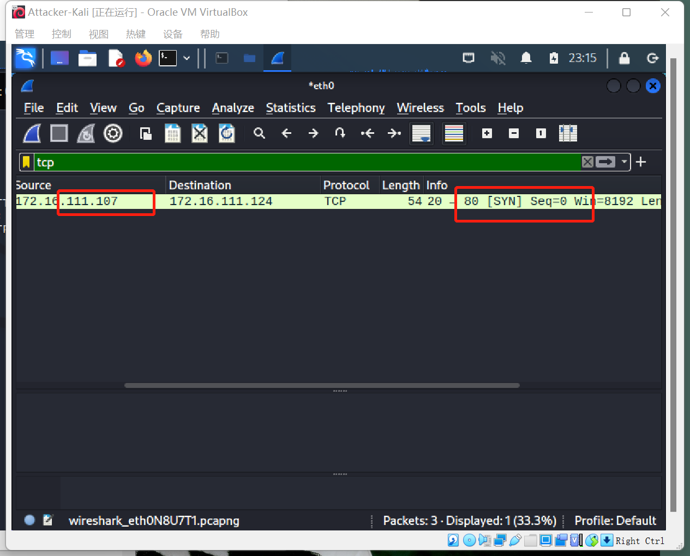

### TCP stealth scan

* 课本原理如下：

    * Attacker 首先发送一个 SYN 数据包到目标主机端口
    * 如果接收到数据包，对数据包进行分析
        * 接收到 SYN/ACK 数据包：判断端口为开放状态，发送 RST 数据包
        * 接收到 RST/ACK 数据包：判断端口为关闭状态
    * 如果没有响应：被过滤
    * TCP stealth scan 与 TCP connect scan 的不同点在于收到 SYN/ACK 数据包后的回复策略，TCP stealth scan 为了躲避防火墙的探测

* 代码思路：
    > Attacker 先发送一个S，然后等待回应。如果有回应且标识为RA，说明目标端口处于关闭状态；如果有回应且标识为SA，说明目标端口处于开放状态。这时TCP stealth scan只回复一个R，不完成三次握手，直接取消建立连接。

    ```shell
    #! /usr/bin/python

    from scapy.all import *


    def tcpstealthscan(dst_ip, dst_port, timeout=10):
        pkts = sr1(IP(dst=dst_ip)/TCP(dport=dst_port, flags="S"), timeout=10)
        if (pkts is None):
            print("Filtered")
        elif(pkts.haslayer(TCP)):
            if(pkts.getlayer(TCP).flags == 0x12):
                send_rst = sr(IP(dst=dst_ip) /
                            TCP(dport=dst_port, flags="R"), timeout=10)
                print("Open")
            elif (pkts.getlayer(TCP).flags == 0x14):
                print("Closed")
            elif(pkts.haslayer(ICMP)):
                if(int(pkts.getlayer(ICMP).type) == 3 and int(stealth_scan_resp.getlayer(ICMP).code) in [1, 2, 3, 9, 10, 13]):
                    print("Filtered")


    tcpstealthscan('172.16.111.124', 80)
    ```

* **TCP 端口开放：** 可以看到 Attacker 发送 SYN 的 TCP 数据包后， 80 端口进行握手回复了 SYN/ACK 数据报；Attacker 回复 RST 数据报。

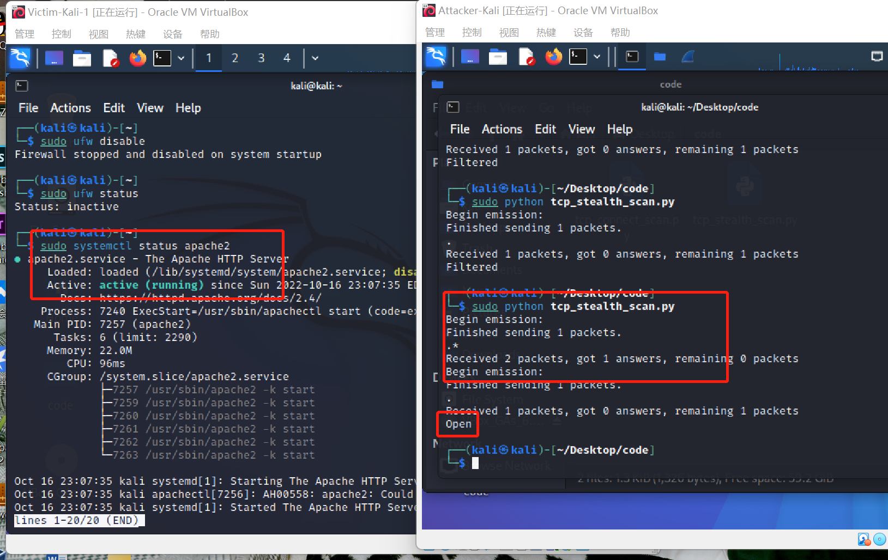
<br>

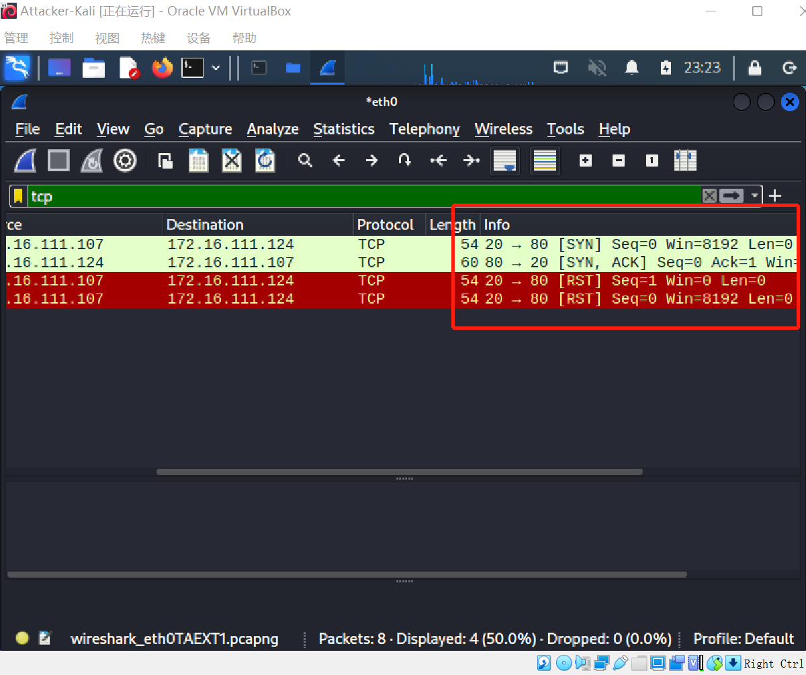
    

* **TCP 端口关闭：** 可以看到 Attacker 发送 SYN 的 TCP 数据包后， 80 端口关闭回复了 RST/ACK 数据报。

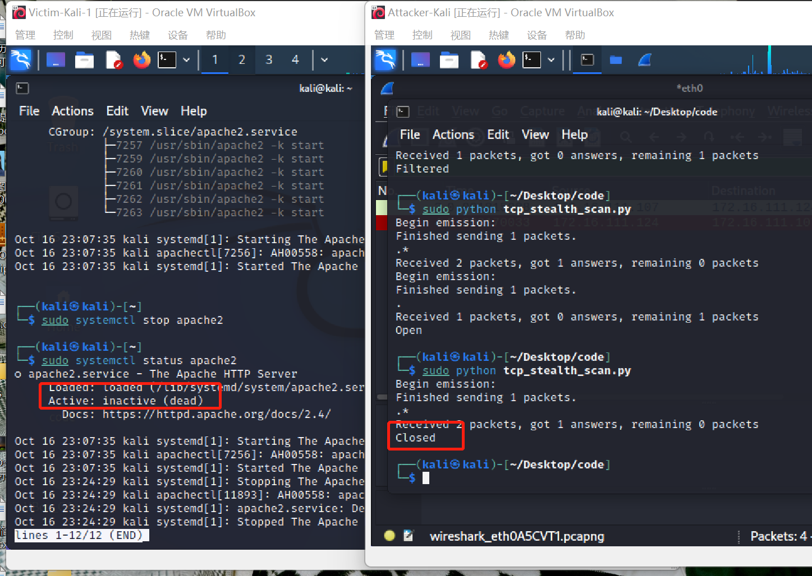
<br>

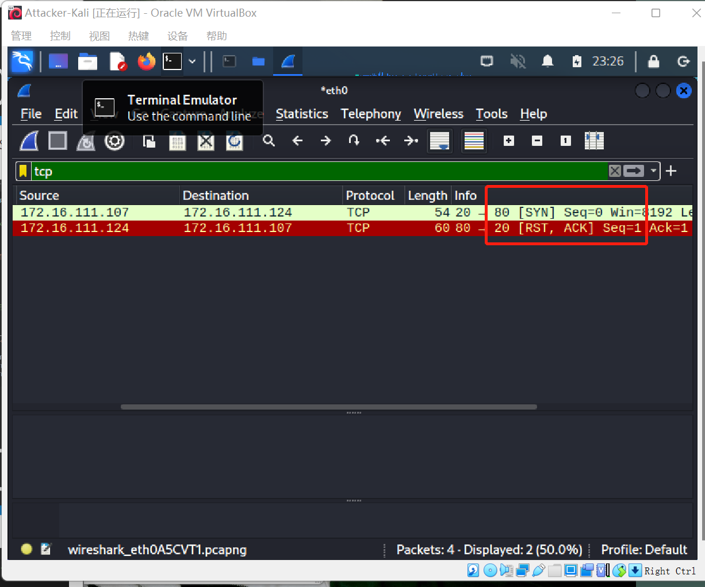

* **开启防火墙：**  Attacker 发送 SYN 的 TCP 数据包后， 80 端口无回应。

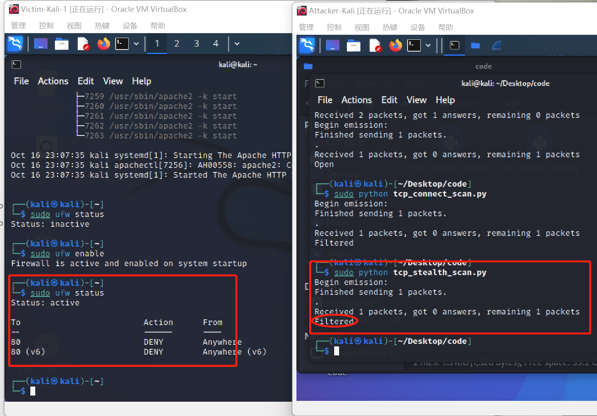
<br>

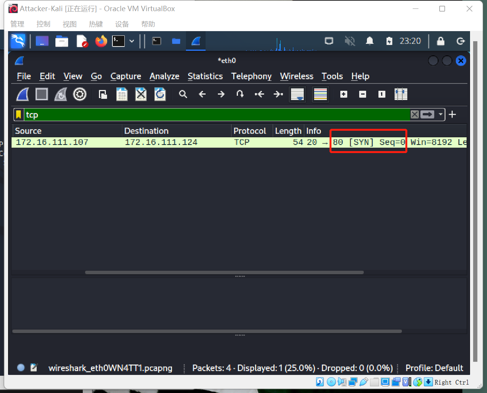

### TCP Xmas scan

* 课本原理如下：

    * Attacker 发送一个 TCP 数据包到目标主机端口，并对 TCP 报文头 FIN URG PUSH 标记进行设置
    * 如果接收到数据包，对数据包进行分析
        * 接收到 RST 数据包，则端口状态为关闭
    * 如果没有响应，则端口状态为开放或过滤

* 代码如下：
    ```shell
    #! /usr/bin/python
    from scapy.all import *


    def Xmasscan(dst_ip, dst_port, timeout=10):
        pkts = sr1(IP(dst=dst_ip)/TCP(dport=dst_port, flags="FPU"), timeout=10)
        if (pkts is None):
            print("Open|Filtered")
        elif(pkts.haslayer(TCP)):
            if(pkts.getlayer(TCP).flags == 0x14):
                print("Closed")
        elif(pkts.haslayer(ICMP)):
            if(int(pkts.getlayer(ICMP).type) == 3 and int(pkts.getlayer(ICMP).code) in [1, 2, 3, 9, 10, 13]):
                print("Filtered")


    Xmasscan('172.16.111.124', 80)
    ```

* **TCP 端口开放：** Attacker 发送一个 TCP 数据包 FIN URG PUSH 标记进行设置，80 端口无回应。

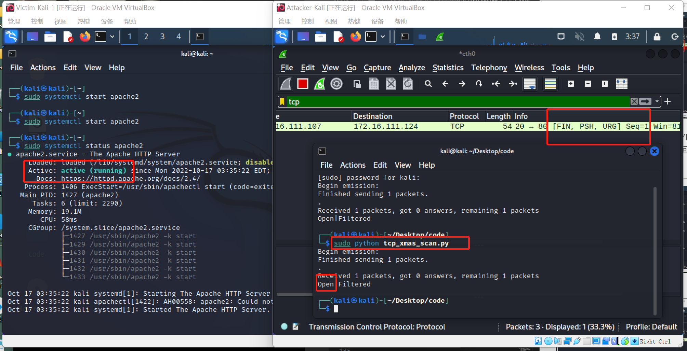

    

* **TCP 端口关闭：** Attacker 发送一个 TCP 数据包 FIN URG PUSH 标记进行设置，80 端口回复 RST/ACK TCP 数据报。

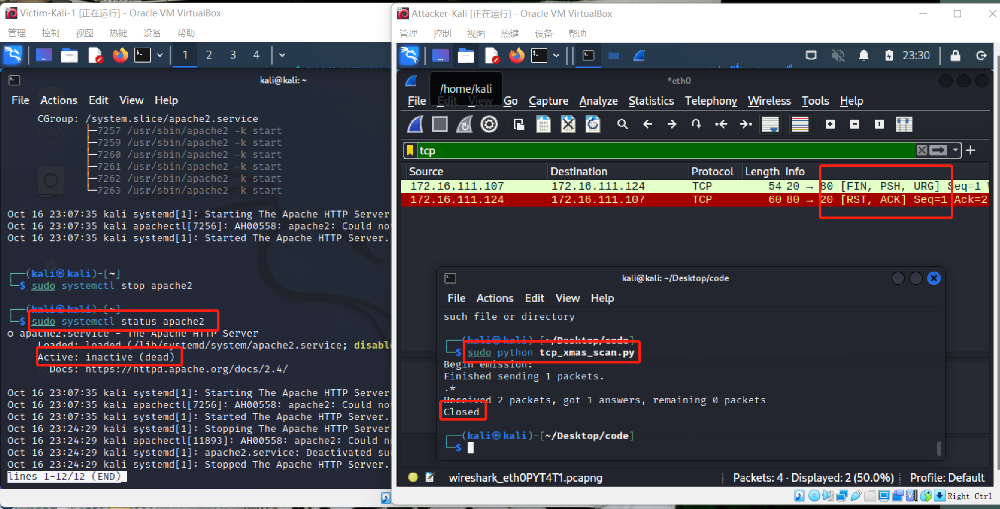


* **开启防火墙：**   Attacker 发送一个 TCP 数据包 FIN URG PUSH 标记进行设置，80 端口无回应。

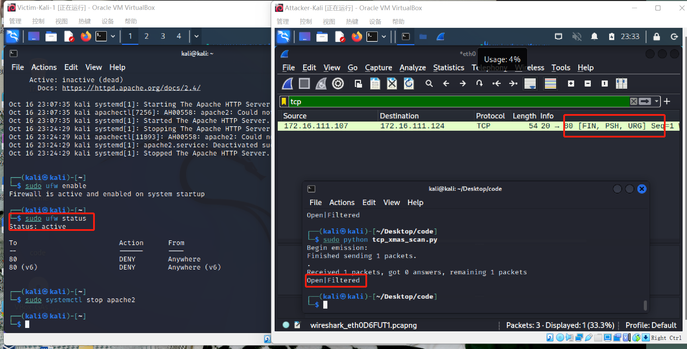


### TCP fin scan

* 课本原理如下：

    * Attacker 发送一个 TCP FIN 数据包到目标主机端口
    * 如果接收到数据包，对数据包进行分析
        * 接收到 RST 数据包，则端口状态为关闭
    * 如果没有响应，则端口状态为开放或过滤

* 代码如下：
    ```shell
    #! /usr/bin/python
    from scapy.all import *


    def finscan(dst_ip, dst_port, timeout=10):
        pkts = sr1(IP(dst=dst_ip)/TCP(dport=dst_port, flags="F"), timeout=10)
        if (pkts is None):
            print("Open|Filtered")
        elif(pkts.haslayer(TCP)):
            if(pkts.getlayer(TCP).flags == 0x14):
                print("Closed")
        elif(pkts.haslayer(ICMP)):
            if(int(pkts.getlayer(ICMP).type) == 3 and int(pkts.getlayer(ICMP).code) in [1, 2, 3, 9, 10, 13]):
                print("Filtered")


    finscan('172.16.111.124', 80)
    ```

* **TCP 端口开放：**  Attacker 发送一个 TCP 数据包 FIN 标记进行设置，80 端口无回应。

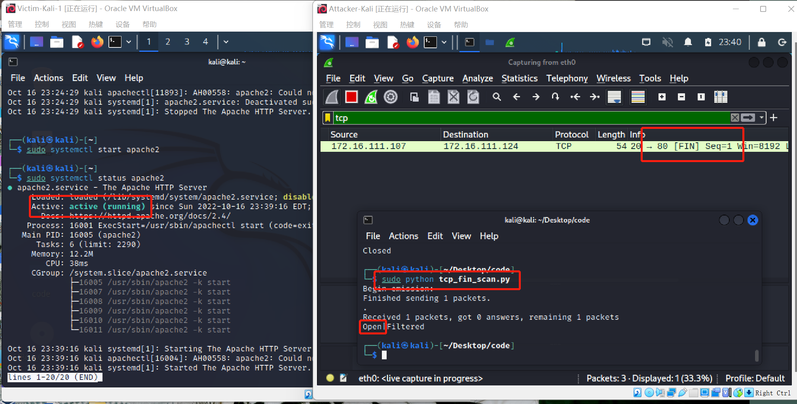

    

* **TCP 端口关闭：** Attacker 发送一个 TCP 数据包 FIN 标记进行设置，80 端口回复 RST/ACK TCP 数据报。

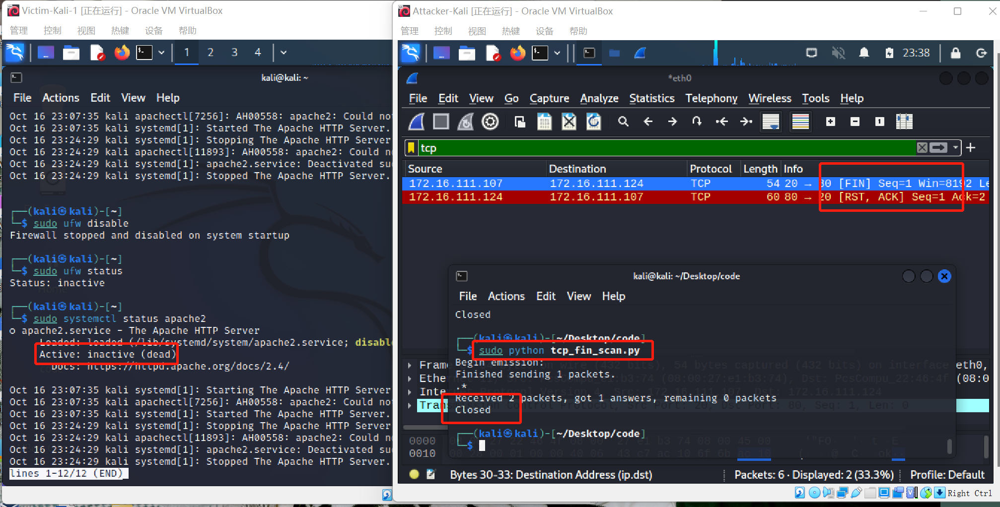


* **开启防火墙：**   Attacker 发送一个 TCP 数据包 FIN 标记进行设置，80 端口无回应。

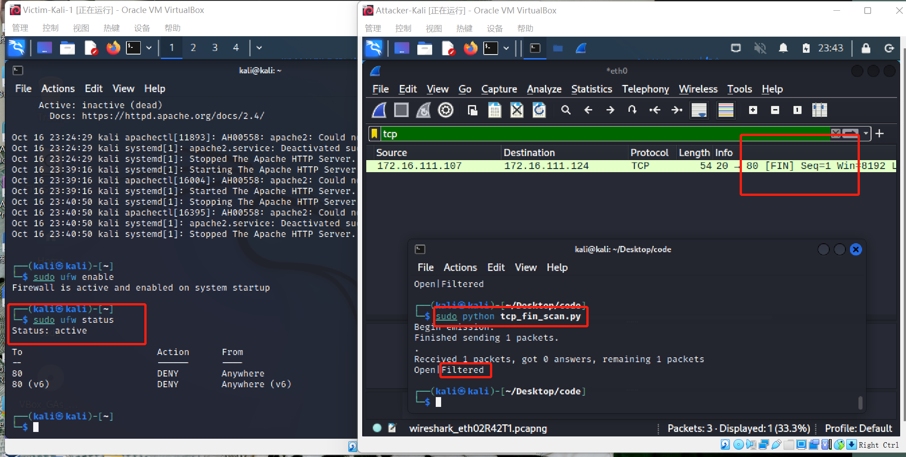

### TCP null scan

* 课本原理如下：

    * Attacker 发送一个 TCP 数据包到目标主机端口，且 TCP 报文头未进行 Flag 设置
    * 如果接收到数据包，对数据包进行分析
        * 接收到 RST 数据包，则端口状态为关闭
    * 如果没有响应，则端口状态为开放或过滤

* 代码如下：
    ```shell
    #! /usr/bin/python
    from scapy.all import *


    def nullscan(dst_ip, dst_port, timeout=10):
        pkts = sr1(IP(dst=dst_ip)/TCP(dport=dst_port, flags=""), timeout=10)
        if (pkts is None):
            print("Open|Filtered")
        elif(pkts.haslayer(TCP)):
            if(pkts.getlayer(TCP).flags == 0x14):
                print("Closed")
        elif(pkts.haslayer(ICMP)):
            if(int(pkts.getlayer(ICMP).type) == 3 and int(pkts.getlayer(ICMP).code) in [1, 2, 3, 9, 10, 13]):
                print("Filtered")


    nullscan('172.16.111.124', 80)
    ```

* **TCP 端口开放：**   Attacker 发送一个 TCP 数据包 FLAG 标记为空，80 端口无回应。

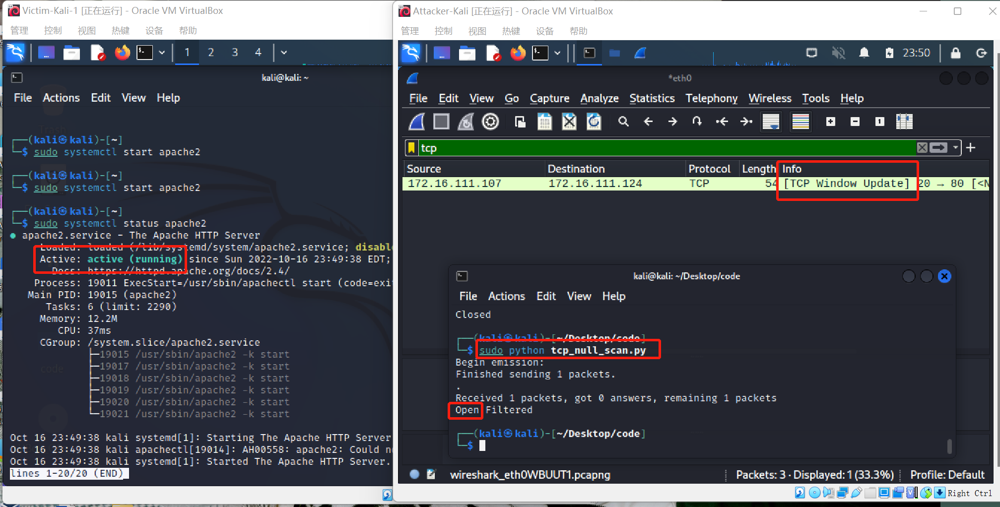

    

* **TCP 端口关闭：** Attacker 发送一个 TCP 数据包 FLAG 标记为空，80 端口回应 RST/ACK TCP 数据报。

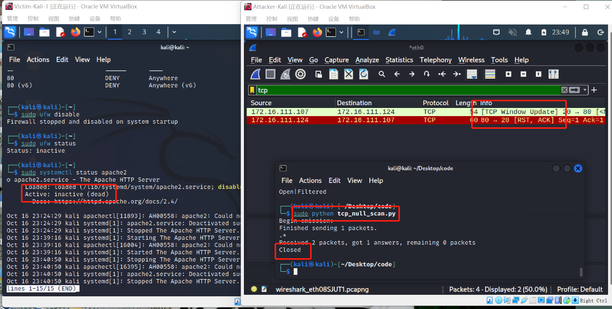


* **开启防火墙：**   Attacker 发送一个 TCP 数据包 FLAG 标记为空，80 端口无回应。

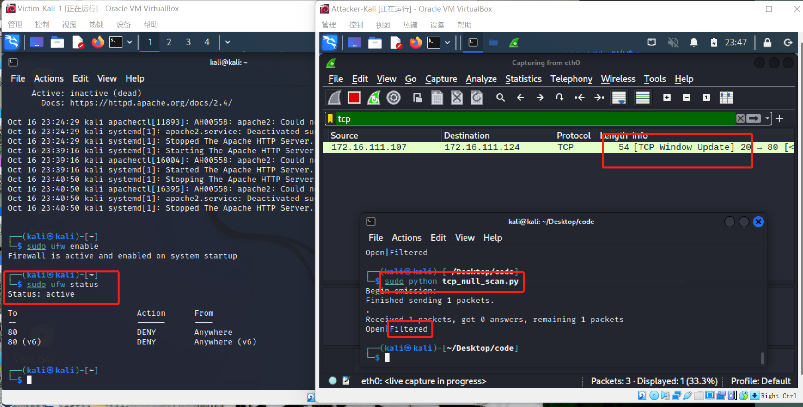

### UDP scan

* 课本原理如下：

    * AAttacker 发送一个零字节的 UDP 数据包到目标主机端口
    * 如果收到一个 ICMP 不可到达的回应，那么则认为这个端口是关闭的
    * 对于没有回应的端口则认为是
        * 开放的
        * 但是如果目标主机安装有防火墙或其它可以过滤数据包的软硬件，将可能得不到任何回应

* 代码如下：
    ```shell
    from scapy.all import *


    def udpscan(dst_ip, dst_port, dst_timeout=10):
        resp = sr1(IP(dst=dst_ip)/UDP(dport=dst_port), timeout=dst_timeout)
        if (resp is None):
            print("Open|Filtered")
        elif (resp.haslayer(UDP)):
            print("Open")
        elif(resp.haslayer(ICMP)):
            if(int(resp.getlayer(ICMP).type) == 3 and int(resp.getlayer(ICMP).code) == 3):
                print("Closed")
            elif(int(resp.getlayer(ICMP).type) == 3 and int(resp.getlayer(ICMP).code) in [1, 2, 9, 10, 13]):
                print("Filtered")
            elif(resp.haslayer(IP) and resp.getlayer(IP).proto == IP_PROTOS.udp):
                print("Open")


    udpscan('172.16.111.124', 8080)
    ```

* **UDP 端口开放：**   Attacker 发送一个零字节 UDP 数据报，8080 端口无回应。

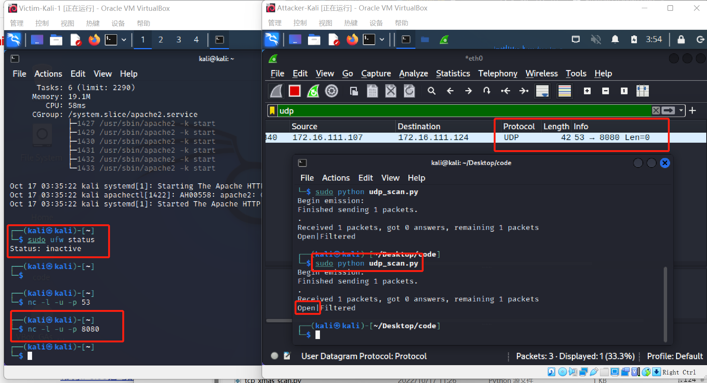

    

* **UDP 端口关闭：** Attacker 发送一个零字节 UDP 数据报，收到 ICMP 不可到达的回应。

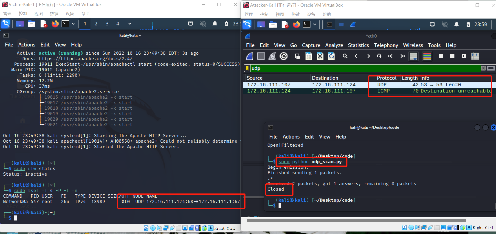


* **开启防火墙：**  Attacker 发送一个零字节 UDP 数据报，8080 端口无回应。

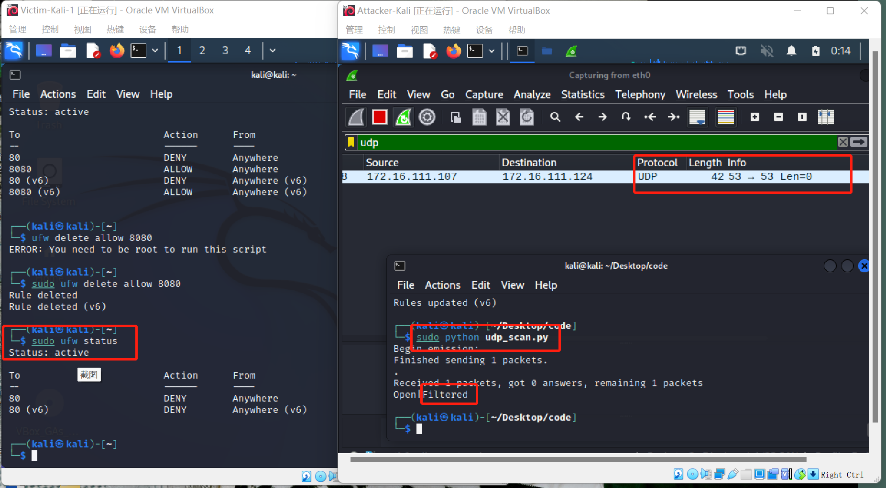


### 复刻 nmap 的上述扫描技术实现的命令行参数开关

* nmap 命令行参数开关

    ```shell
    nmap -sS 172.16.111.124 # TCP 半开扫描
    nmap -sX 172.16.111.124 # Xmas
    nmap -sF 172.16.111.124 # FIN
    nmap -sN 172.16.111.124 # Null
    nmap -sU 172.16.111.124 # UDP 扫描 
    ```

* 代码如下：
    ```shell 
    # -*-coding:utf-8 -*-
    #! /usr/bin/python3
    import sys
    from scapy.all import *
    import getopt

    # 使用上述实验过程中编写的 python 代码，参数为 ip 地址, 代码扫描 80/8080/443/53 等端口
    def udpscan(dst_ip, dst_timeout=10):
        dst_port = 8080
        resp = sr1(IP(dst=dst_ip)/UDP(dport=dst_port), timeout=dst_timeout)
        if (resp is None):
            print("Open|Filtered")
        elif (resp.haslayer(UDP)):
            print("Open")
        elif(resp.haslayer(ICMP)):
            if(int(resp.getlayer(ICMP).type) == 3 and int(resp.getlayer(ICMP).code) == 3):
                print("Closed")
            elif(int(resp.getlayer(ICMP).type) == 3 and int(resp.getlayer(ICMP).code) in [1, 2, 9, 10, 13]):
                print("Filtered")
            elif(resp.haslayer(IP) and resp.getlayer(IP).proto == IP_PROTOS.udp):
                print("Open")


        # udpscan('172.16.111.124', 8080)

    def Xmasscan(dst_ip, timeout=10):
        dst_port = 80
        pkts = sr1(IP(dst=dst_ip)/TCP(dport=dst_port, flags="FPU"), timeout=10)
        if (pkts is None):
            print("Open|Filtered")
        elif(pkts.haslayer(TCP)):
            if(pkts.getlayer(TCP).flags == 0x14):
                print("Closed")
        elif(pkts.haslayer(ICMP)):
            if(int(pkts.getlayer(ICMP).type) == 3 and int(pkts.getlayer(ICMP).code) in [1, 2, 3, 9, 10, 13]):
                print("Filtered")


        # Xmasscan('172.16.111.124', 80)

    def finscan(dst_ip, timeout=10):
        dst_port = 80
        pkts = sr1(IP(dst=dst_ip)/TCP(dport=dst_port, flags="F"), timeout=10)
        if (pkts is None):
            print("Open|Filtered")
        elif(pkts.haslayer(TCP)):
            if(pkts.getlayer(TCP).flags == 0x14):
                print("Closed")
        elif(pkts.haslayer(ICMP)):
            if(int(pkts.getlayer(ICMP).type) == 3 and int(pkts.getlayer(ICMP).code) in [1, 2, 3, 9, 10, 13]):
                print("Filtered")


        # finscan('172.16.111.124', 80)

    def nullscan(dst_ip, timeout=10):
        dst_port = 80
        pkts = sr1(IP(dst=dst_ip)/TCP(dport=dst_port, flags=""), timeout=10)
        if (pkts is None):
            print("Open|Filtered")
        elif(pkts.haslayer(TCP)):
            if(pkts.getlayer(TCP).flags == 0x14):
                print("Closed")
        elif(pkts.haslayer(ICMP)):
            if(int(pkts.getlayer(ICMP).type) == 3 and int(pkts.getlayer(ICMP).code) in [1, 2, 3, 9, 10, 13]):
                print("Filtered")


        # nullscan('172.16.111.124', 80)

    def tcpstealthscan(dst_ip, timeout=10):
        dst_port = 80
        pkts = sr1(IP(dst=dst_ip)/TCP(dport=dst_port, flags="S"), timeout=10)
        if (pkts is None):
            print("Filtered")
        elif(pkts.haslayer(TCP)):
            if(pkts.getlayer(TCP).flags == 0x12):
                send_rst = sr(IP(dst=dst_ip) /
                            TCP(dport=dst_port, flags="R"), timeout=10)
                print("Open")
            elif (pkts.getlayer(TCP).flags == 0x14):
                print("Closed")
            elif(pkts.haslayer(ICMP)):
                if(int(pkts.getlayer(ICMP).type) == 3 and int(stealth_scan_resp.getlayer(ICMP).code) in [1, 2, 3, 9, 10, 13]):
                    print("Filtered")


        # tcpstealthscan('172.16.111.124', 80)


    def main(argv):
    dst_ip = ''
    try:
        opts, args = getopt.getopt(argv, 'h', ['help','sF=',
        'sX=','sN=','sS=','sU='])
        
        # print("opts:{},\targs:{}".format(opts, args))
    except getopt.GetoptError:
        print('Usage:   test.py -i <inputfile> -o <outputfile>')
        sys.exit(2)
    for opt, arg in opts:
        if opt == '-h':
            print('test.py --sF/--sX/--sN/--sS/--sU <dst_ip> ')
            sys.exit()
        elif opt in ("--sF"):
            dst_ip  = arg
            finscan(dst_ip)
        elif opt in ("--sX"):
            dst_ip  = arg
            Xmasscan(dst_ip)
        elif opt in ("--sN"):
            dst_ip  = arg
            nullscan(dst_ip)
        elif opt in ("--sS"):
            dst_ip  = arg
            tcpstealthscan(dst_ip)
        elif opt in ("--sU"):
            dst_ip  = arg
            udpscan(dst_ip)


    if __name__ == "__main__":
    # print(sys.argv[1:])
    main(sys.argv[1:])
    ```

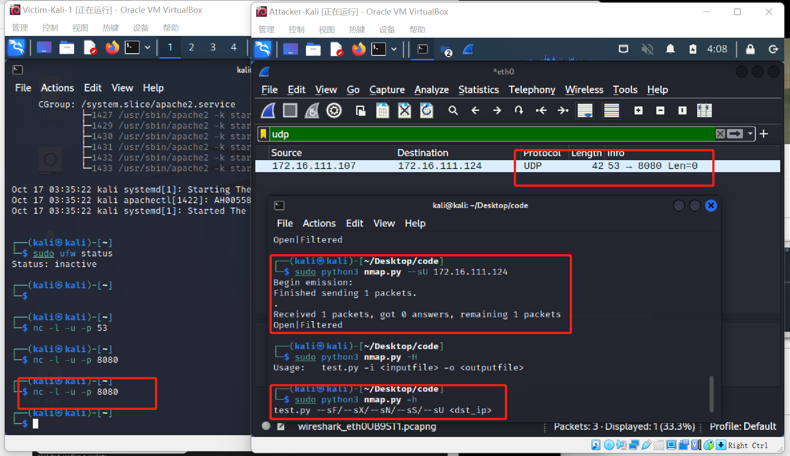


## 参考资料

- [Port scanning using Scapy](https://resources.infosecinstitute.com/topic/port-scanning-using-scapy/)

- [2022-ns-public-worrycuc](https://github.com/CUCCS/2022-ns-public-worrycuc/blob/chapter0x05/ch5/chapter5.md)

- [kalilinux开启端口、关闭防火墙方法](https://blog.csdn.net/crayon0/article/details/122272032)